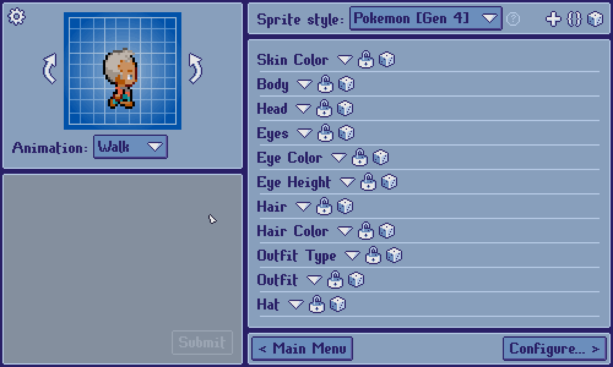
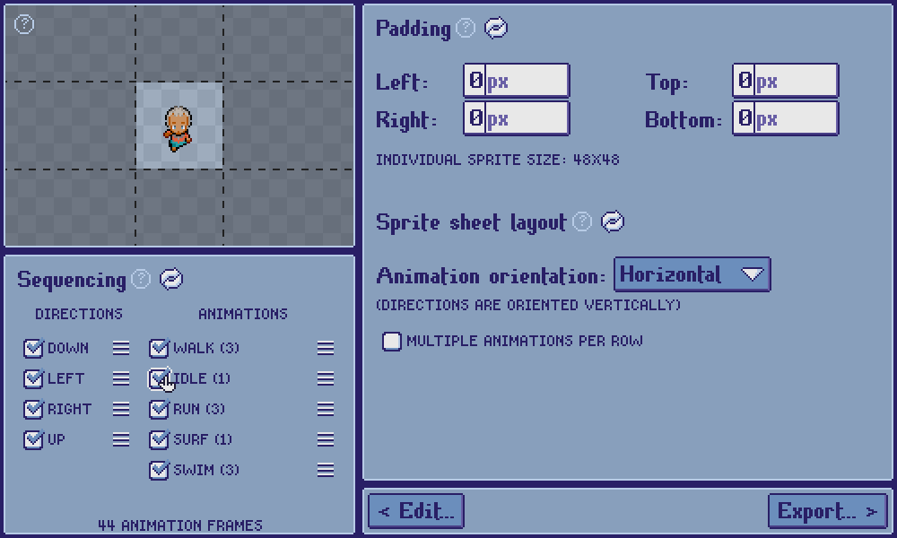

[***< Theory***](./README.md)

# Animations

> For the API type page, see [`anim`](../anim.md). For the constructor, see [`$Init::anim`](../init.md#anim).

**Animations**, along with [directions](./t_dir.md) and [layers](./t_layer.md), are one of the fundamental building blocks of a [sprite style](./t_style.md) in *Top Down Sprite Maker*. An animation consists of a set number of frames, each of which lasts a set number of program ticks. Generally, an animation represents an action, such as walking, running, or being idle.

Users can select from the active sprite style's animations in the preview panel.

They may also determine which animations to include in the export (and in which order) on the Configuration screen.

> **Note:**
> 
> * Animations may be static and only consist of a single frame
> * An animation's frame count and frame timings must be the same for all directions
