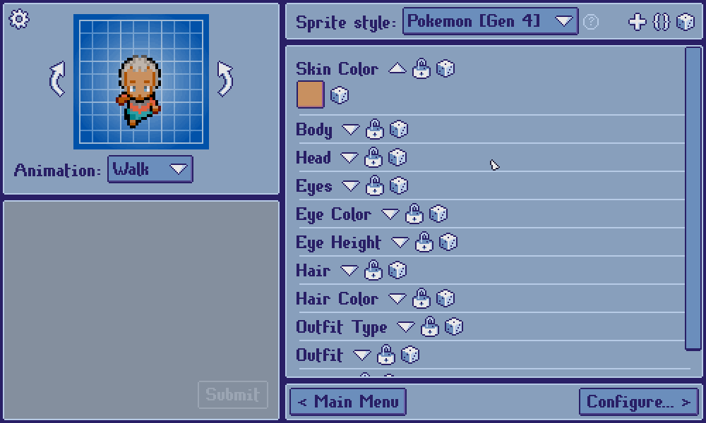

[***< Theory***](./README.md)

# Color selections

> For the API type page, see [`col_sel`](../col_sel.md). For the constructor, see [`$Init::col_sel`](../init.md#col_sel).

**Color selections** are used to assign colors to customizable color components, such as skin color, hair color, or the color of an item of clothing.

## Swatches

Color selections can provide a pre-determined set of colors -- **swatches** -- to choose from. A color selection should provide no more than 12 swatches.

### Any color?

Color selections can be defined as permitting any color. Such color selections can be assigned any RGB color. If not, they are limited to their swatches.

### Default swatches

Providing no swatches will automatically populate a color selection with *TDSM*'s default swatches.

These are:

* `#000000`
* `#FFFFFF`
* `#808080`
* `#E02020`
* `#20E020`
* `#2020E0`
* `#C06000`
* `#603010`
* `#E0C000`
* `#B000B0`
* `#FF80C0`
* `#00B0B0`

<!-- TODO -->
