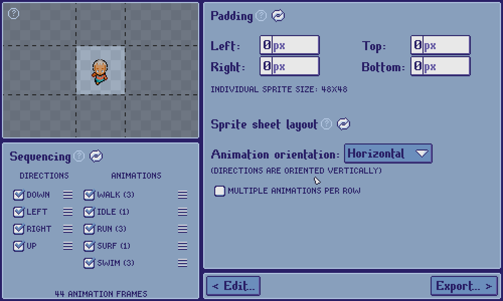
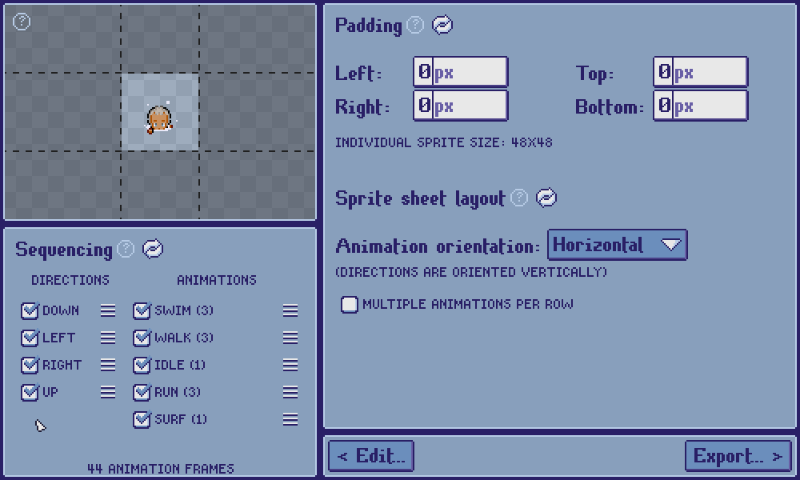
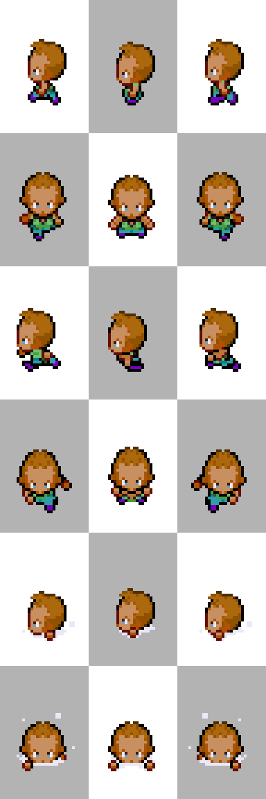
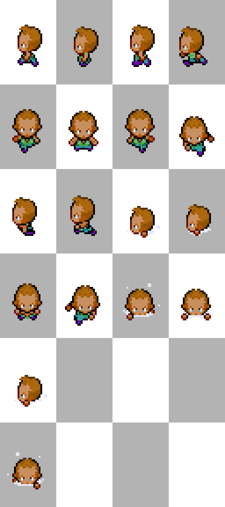
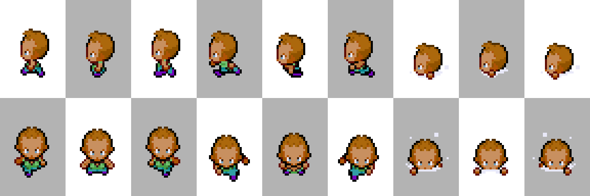
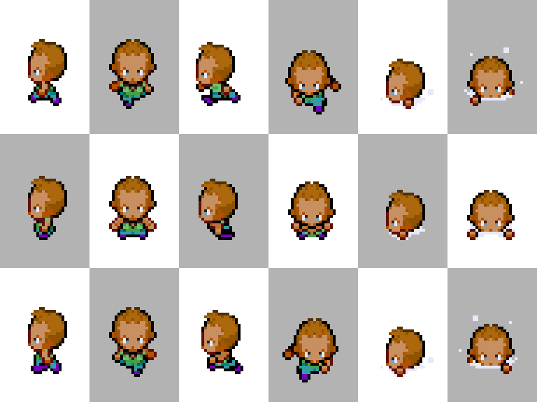
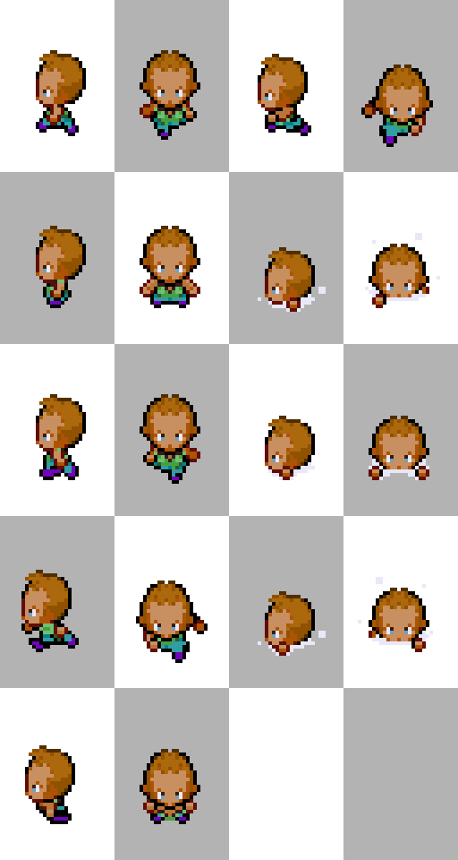

[***< Theory***](./README.md)

# Configuration

*Top Down Sprite Maker* gives users a large degree of control to configure sprite sheets.

**Configuration** is split into three categories: [padding](#padding), [sequencing](#sequencing), and [layout](#layout).

## Padding

By default, the pixel dimensions of individual frames in the exported sprite sheet is derived from the default sprite dimensions set by the [sprite style](./t_style.md). However, this can be overridden by padding or cropping pixels along each edge. Users can export sprite sheets with individual frames ranging from 1x1 pixels to 128x128 pixels.

To crop rather than pad, simply input a negative integer in one of the edge fields.

> **Note:**
> 
> * Cropping edges may cut off pixels with non-transparent contents
> * All frames/sprites in an exported sprite sheet have the same dimensions

## Sequencing

Users can determine which of a sprite style's [directions](./t_dir.md) and [animations](./t_anim.md) to include in an exported sprite sheet, and in which order.

For example, if a sprite style is 8-directional (N, NW, NE, W, E, SW, SE, S) and includes the animations "idle", "walk", "run", "hurt", "jump", but the user intends to export a sprite sheet for an NPC in a game with a movement system that is 4-directional, they may wish to only export the directions N, W, S, and E, and only export the animations "idle" and "walk".

## Layout

**Layout** deals with how frames/sprites are arranged in the exported sprite sheet. Users can determine whether animations should be sequenced vertically or horizontally. Directions will be sequenced along the complementary axis. Additionally, users may determine whether multiple animations should be sequenced in a single row/column and more.

    
<b>Example:</b>

| Animation orientation | Multiple animations per row/column? | All animations on a single row/column? | Frames per row/column | Wrap animations across rows/columns? |               Result                |
|:---------------------:|:-----------------------------------:|:--------------------------------------:|:---------------------:|:------------------------------------:|:-----------------------------------:|
|      Horizontal       |                 No                  |                  N/A                   |          N/A          |                 N/A                  |    |
|      Horizontal       |                 Yes                 |                   No                   |           4           |                 Yes                  |  |
|      Horizontal       |                 Yes                 |                  Yes                   |          N/A          |                 N/A                  |  |
|       Vertical        |                 No                  |                  N/A                   |          N/A          |                 N/A                  |  |
|       Vertical        |                 Yes                 |                   No                   |           5           |                 Yes                  |  |

