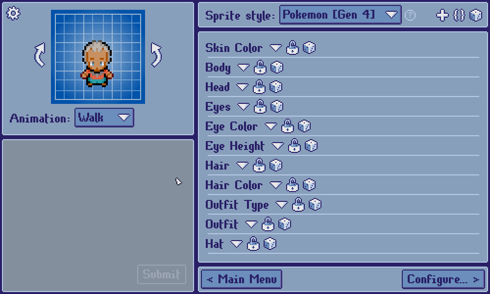

[***< Theory***](./README.md)

# Directions

**Directions**, along with [animations](./t_anim.md) and [layers](./t_layer.md), are one of the fundamental building blocks of a [sprite style](./t_style.md) in *Top Down Sprite Maker*.

A sprite style must declare which directional system it implements. At present, sprite styles can support:
* 4 directions (N, W, S, E)
* 6 directions (N, NW, NE, S, SW, SE)
* 8 directions (N, NW, NE, W, E, SW, SE, S)

Users can use the arrows in the preview panel to turn the current customization around.

They may also determine which directions to include in the export (and in which order) on the Configuration screen.

> **Note:**
> 
> Directions are represented as strings in the API. Rather than hard-coding raw strings in your scripts, it is recommended to use the [direction constants](../global.md#directions).
