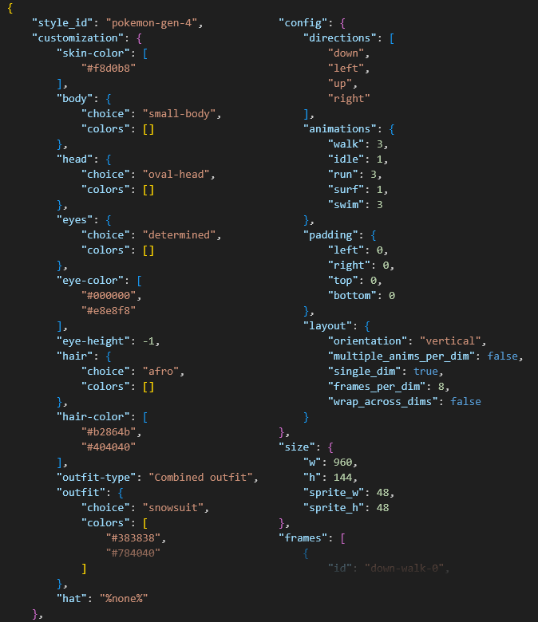

[***< Theory***](./README.md)

# Export

*Top Down Sprite Maker* provides some options on export.

The program always exports the sprite sheet as a flattened PNG image with a transparent background. In addition to this, users may export the sprite sheet's metadata as a JSON file, and may export a version of the sprite sheet with layers separated as a *Stipple Effect* project.

## JSON metadata

JSON (short for JavaScript Object Notation) is a text file format used to represent data as a series of key-value pairs.

Exporting a sprite sheet's metadata has a few potential uses. The metadata includes information about the ID of each animation frame and its position in the sprite sheet, the [sprite style](./t_style.md), customization choices, as well as [configuration settings](./t_config.md).

The JSON can be passed to a game engine to automatically split and tag the sprites in the associated sprite sheet.

### Loading sprites

It can also be re-uploaded to *Top Down Sprite Maker* to load that character back into the program, provided the same sprite style (or a sprite style with the same ID and all the same layer IDs and customization choices as outlined in the JSON) has been uploaded to the *TDSM* program instance.

**JSON metadata example:**

## *Stipple Effect* project

The layer-separated *Stipple Effect* project can be used to modify the sprite sheet. For example, you can disable a particular clothing layer to create a variation of your sprite that is shirtless.

> **More information about *Stipple Effect*:**
> * [Website](https://stipple-effect.github.io)
> * [Store page](https://flinkerflitzer.itch.io/stipple-effect)
> * [GitHub repository](https://github.com/stipple-effect/stipple-effect)
