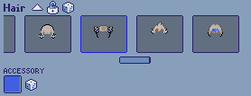
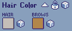
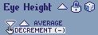
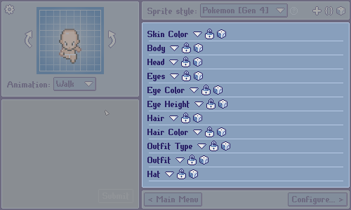

[***< Theory***](./README.md)

# Layers

> For the API type page, see [`layer`](../layer.md).

**Layers**, along with [animations](./t_anim.md) and [directions](./t_dir.md), are the fundamental building blocks of a [sprite style](./t_style.md) in *Top Down Sprite Maker*. Sprite styles are designed to compose layers in a paper doll system to generate sprites.

    
<b>Contents</b>

* [Types of layers](#types-of-layers)
  * [Asset choice layer](#asset-choice-layer)
  * [Asset layer](#asset-layer)
  * [Color selection layer](#color-selection-layer)
  * [Composed layer](#composed-layer)
  * [Decision layer](#decision-layer)
  * [Dependent layer](#dependent-layer)
  * [Group layer](#group-layer)
  * [Mask layer](#mask-layer)
  * [Math layer](#math-layer)
* [Assembly layers vs. customization layers](#assembly-layers-vs-customization-layers)
  * [Assembly layers](#assembly-layers)
  * [Customization layers](#customization-layers)

## Types of layers

There are several **types of layers**. Each type is distinct in its functionality and uses.

A layer type is either *trivial* or *non-trivial*. Trivial layers do not have customizable or adjustable values, whereas non-trivial layers do.

Similarly, a layer type is either *rendered* or *non-rendered*. Rendered layers produce an image and can be defined as assembly layers as part of the sprite generation pipeline, while non-rendered layers cannot.

### Asset choice layer

| Assembly eligibility | Customization eligibility |
|:--------------------:|:-------------------------:|
|    Yes (rendered)    |     Yes (non-trivial)     |

**Constructor:** [`$Init::asset_choice_layer`](../init.md#asset_choice_layer)

**Asset choice layers** have the user choose from multiple [asset choices](./t_asset_choice.md). It may be possible for users to choose to assign *no selection*. Asset choice layers can be combined with [dependent layers](#dependent-layer) that match their choice to facilitate asset selections that span multiple layers (e.g. defining hairstyle as an asset choice layer with a dependent layer to represent the back of the head, rendered below the base head).

### Asset layer

| Assembly eligibility | Customization eligibility |
|:--------------------:|:-------------------------:|
|    Yes (rendered)    |       No (trivial)        |

**Constructor:** [`$Init::asset_layer`](../init.md#asset_layer)

**Asset layers** retrieve a specific image asset and slice it into a sprite sheet.

### Choice layer

| Assembly eligibility | Customization eligibility |
|:--------------------:|:-------------------------:|
|  No (non-rendered)   |     Yes (non-trivial)     |

**Constructor:** [`$Init::choice_layer`](../init.md#choice_layer)

**Choice layers** have the user choose from multiple text prompts.
The currently selected choice is usually queried by other logic-based layers like [decision layers](#decision-layer) or [composed layers](#composed-layer).

### Color selection layer

| Assembly eligibility | Customization eligibility |
|:--------------------:|:-------------------------:|
|  No (non-rendered)   |     Yes (non-trivial)     |

**Constructor:** [`$Init::col_sel_layer`](../init.md#col_sel_layer)

**Color selection layers** are containers for one or more [color selections](./t_col_sel.md).

> **Note:**
> 
> Perhaps counterintuitively, color selection layers are ***not*** rendered layers. Although changing the color assigned to a color selection is usually reflected as a change in the assembled sprite sheet, color selections are not an assembled visual component themselves.

### Composed layer

| Assembly eligibility | Customization eligibility |
|:--------------------:|:-------------------------:|
|    Yes (rendered)    |       No (trivial)        |

**Constructor:** [`$Init::composed_layer`](../init.md#composed_layer)

**Composed layers** consist of a function that takes a sprite ID (e.g. "left-walk-1") as input and returns an image representing the layer's contents for that sprite ID. They often compose the results of multiple rendered layers together.

### Decision layer

| Assembly eligibility | Customization eligibility |
|:--------------------:|:-------------------------:|
| *Depends on output*  |    *Depends on output*    |

**Constructor:** [`$Init::decision_layer`](../init.md#decision_layer)

**Decision layers** are made up of a function that dynamically produces an output layer every time the user makes a choice (or [randomization](./t_rand_lock.md) occurs).

A decision layer can be used to dynamically allocate assembly or customization layers. However, a given decision layer that is defined as an assembly or customization layer in a sprite style should only return layers eligible for assembly or customization, respectively.

### Dependent layer

| Assembly eligibility | Customization eligibility |
|:--------------------:|:-------------------------:|
|    Yes (rendered)    |       No (trivial)        |

**Constructor:** [`$Init::dependent_layer`](../init.md#dependent_layer)

**Dependent layers** complement a specific [asset choice layer](#asset-choice-layer), known as their *reference layer*. A dependent layer will dynamically match the asset code of its reference layer. Thus, a dependent layer must be able to produce valid image output for all the possible selections of its reference layer.

As the dependent layer's choice is tied to its reference layer, unlike asset choice layers, dependent layers are *trivial* and cannot be customization layers.

### Group layer

| Assembly eligibility | Customization eligibility |
|:--------------------:|:-------------------------:|
| *Depends on output*  |    *Depends on output*    |

**Constructor:** [`$Init::group_layer`](../init.md#group_layer)

**Group layers** consist of an array of layers, which are known as *member layers*. Group layers should only be used when multiple layers need to be treated as a single layer. The only use case for this that users are likely to encounter is as one of the parallel output options of a [decision layer](#decision-layer). 

<!-- TODO - visual aid -->

### Mask layer

| Assembly eligibility | Customization eligibility |
|:--------------------:|:-------------------------:|
|  No (non-rendered)   |       No (trivial)        |

**Constructor:** [`$Init::mask_layer`](../init.md#mask_layer)

**Mask layers** are auxiliary layers that use logic to define an alpha mask. An alpha mask is an image where every non-transparent pixel is marked as "to be erased". Mask layers can affect one or multiple layers, erasing pixels of their target layers that are captured by their alpha mask.

<!-- TODO - visual aid -->

### Math layer

| Assembly eligibility | Customization eligibility |
|:--------------------:|:-------------------------:|
|  No (non-rendered)   |     Yes (non-trivial)     |

**Constructor:** [`$Init::math_layer`](../init.md#math_layer)

**Math layers** allow the user to assign a value from within a range of integers. The layer's current value is usually queried and operated on by other layers.

## Assembly layers vs. customization layers

Layers in *TDSM* have two purposes: ***assembly*** and ***customization***. Layers that have a visual component and constitute a part of the sprite composition are known as *assembly layers*, while layers that have a choice for users to make are known as *customization layers*. These categories are not mutually exclusive. Certain layer types, such as [*asset choice layers*](#asset-choice-layer), for example, can be both assembly and customization layers.

### Assembly layers

**Assembly layers** are the layers of a sprite sheet that are composed on top of one another to produce the assembled sprite sheet. In order for a [type of layer](#types-of-layers) to be eligible as an assembly layer, it must be *rendered*.

> **Note:**
> 
> Just because a layer that is part of a sprite style is rendered does not mean it has to be defined as an assembly layer. You may opt to pre-compose multiple rendered layers as part of a [composed layer](#composed-layer) and define the composed layer as one of the sprite styles assembly layers instead.

### Customization layers

**Customization layers** are the layers of a sprite style where the user has a decision to make. In order for a [type of layer](#types-of-layers) to be eligible as a customization layer, it must be *non-trivial*.

A sprite style's customization layers are listed on the right side of the customization page:

