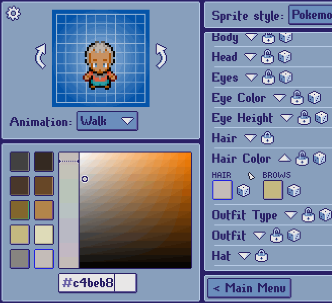
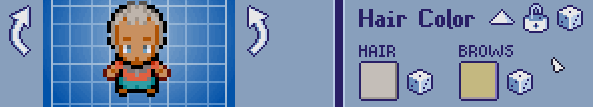
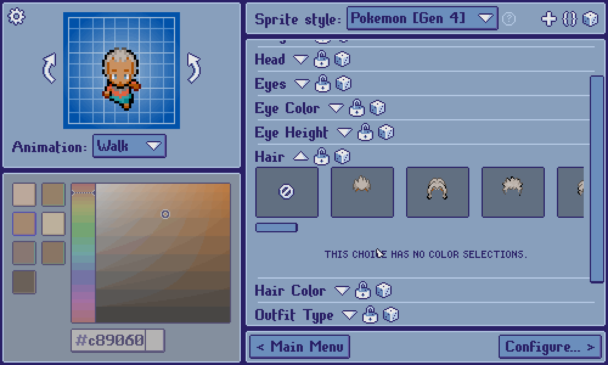
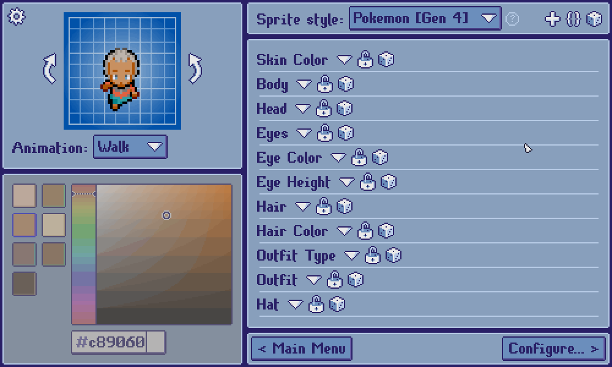

[***< Theory***](./README.md)

# Randomization

**Randomization** in *Top Down Sprite Maker* is represented by the  icon.

Randomization can occur at three levels: [color selection](#randomizing-a-color-selection), [layer](#randomizing-a-layer), or the [sprite
style](#randomizing-a-sprite-style) itself.

## Randomizing a color selection

When a [color selection](./t_col_sel.md) is randomized, its color value is assigned to one of its [swatches](./t_col_sel.md#swatches) at random.

## Randomizing a layer

All non-trivial layers can be randomized. [Layers of different types](./t_layer.md#types-of-layers) process randomization differently. Please read the dedicated page about layers to learn more about layer types.

### Choice layers

The program chooses one of the choice texts at random.

### Math layers

The program chooses a random value from within the layer's minimum and maximum bounds.

### Color selection layers

Each color selection in the layer is randomized.

### Asset choice layers

The program chooses one of the asset choices, or no choice, if valid, at random.

    
<b>No choice randomization behaviour:</b>

> An asset choice layer consists of one or more assets (images) to choose from. A hairstyle layer is an obvious example. Asset choice layers may include a "no choice" option (see [`no_choice`](../no_choice.md)), where not choosing any asset is a valid choice. As per the hairstyle layer example, this might be the way a sprite style represents baldness as a choice.
> 
> 
> 
> Asset choice layers that support a "no choice" option must define logic that determines the randomization behaviour of no choice. Such layers can either assign an explicit percentage chance of randomization coming up with no choice (see [`$Init::no_choice_prob`](../init.md#no_choice_prob)), or can treat "no choice" as any other choice and give them equal odds of being assigned by randomization (see [`$Init::no_choice_equal`](../init.md#no_choice_equal)).

## Randomizing a sprite style

An entire character can be randomized at once by clicking the die in the top-right corner of the customization screen. This will sequentially randomize every one of a [sprite style](./t_style.md)'s customization layers that isn't locked.

### Locking

Locking a layer excludes it from style-level randomization. This is an effective strategy for constraining randomization.

Constraining randomization means to control certain variables and characteristics
of a customization. When such layers are locked, their value will persist when
the sprite style is randomized. For example, if you want to randomize a sprite
style, but you want the hairstyle, hat, and skin color to remain the same, you can
simply lock those layers and click the die in the top-right corner. The result
will be a newly randomized set of traits, but those defined by locked layers will
remain the same.

