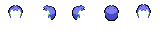
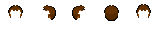

[***< Theory***](./README.md)

# Color replacement

> For the API type page, see [`replacement`](../replacement.md). For the constructor, see [`$Init::replacement`](../init.md#replacement).

*Top Down Sprite Maker* uses **color replacements** to recolor image assets using the values of [color selections](./t_col_sel.md). These operations are *dynamic* and *non-destructive*; the sources of the assets that are recolored are not modified.

## Applications

Color replacements can be applied to [asset layers](./t_layer.md#asset-layer), as well as [asset choices](./t_asset_choice.md) of [asset choice layers](./t_layer.md#asset-choice-layer).

## Representation

Color replacements, represented by the [`replacement`](../replacement.md) type in the API, consist of an ***index*** and a ***color transformation*** (color to color function).

### Index

The **index** determines which of an asset layer or asset choice's influencing color selections to query for the function's input color.
* Negative indices or indices otherwise out of range are not processed; such pixels retain their original color. It is recommended to use `-1` as a convention.
* When performed on ***asset layers***, the influencing color selections constitute the color selections added to the asset layer via [`layer::add_influences`](../layer.md#add_influences), in the order they were added.
* When performed on ***asset choices***, the influencing color selections constitute the color selections defined as part of the asset choice (see [`$Init::asset_choice`](../init.md#asset_choice)), followed by the color selections added to the asset choice's parent asset choice layer via [`layer::add_influences`](../layer.md#add_influences).

### Color transformation

If the replacement has a valid index, the program queries the color currently assigned to the influencing color selection corresponding to the index. This color is the input of the color transformation. It is operated on to return a color that is used to recolor a pixel of the asset layer or asset choice.

<details>
    <summary><b>Example:</b></summary>

|                   Asset                   |              Recolored asset              | Influencing color selections |
|:-----------------------------------------:|:-----------------------------------------:|:----------------------------:|
|        |  |    Skin color, hair color    |

**Replacement determination logic:**

For some pixel with the color `input` in the source asset, this function defines the replacement behaviour.

```js 
replace(~ color input -> replacement) {
    ~ color BASE_SKIN = #b8f8b8;
    ~ color BASE_HAIR = #b0b0f8;
    
    ~ color{} SKIN = { BASE_SKIN, #98e898, #70d870 };
    ~ color{} OUTLINE = {  #557840, #364030 };
    ~ color{} HAIR = { BASE_HAIR, #8080f0, #4848c8, #303070 };
    
    ~ color rgb_input = rgb_only(input);

    int index = -1;
    color b = #000000;

    ~ bool is_skin = SKIN.has(rgb_input);
    ~ bool is_outline = OUTLINE.has(rgb_input);
    ~ bool is_hair = HAIR.has(rgb_input);
    
    if (is_skin || is_outline) {
        index = 0;
        b = BASE_SKIN;
    } else if (is_hair) {
        index = 1;
        b = BASE_HAIR;
    }

    ~ color base = b;

    return $Init.replacement(index, c -> {
        ~ float s_ratio = (c.sat * input.sat) / base.sat;
        ~ float v_ratio = (c.val * input.val) / base.val;
        ~ float s = clamp(0.0, s_ratio, 1.0);
        ~ float v = clamp(0.0, v_ratio, 1.0);

        if (is_outline) {
            ~ float hue_diff = base.hue - input.hue;
            ~ float hue = $ColorProc.normalize_hue(c.hue - hue_diff);

            return $ColorProc.hsv(hue, s, v);
        }

        return $ColorProc.hsv(c.hue, s, v, input.a);
    });
}
```
</details>
